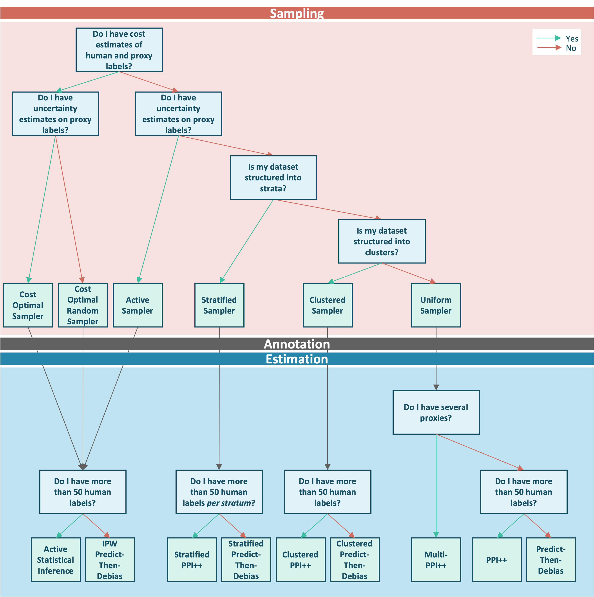

# Overview

This section collects end-to-end tutorials for each combination of sampler and estimator available in GLIDE. Each tutorial walks through a complete path from sampling to annotation to estimation on a simulated dataset, so you can follow along with the use case that best matches your own.

If you are new to GLIDE, read the [User Guide](../user_guide/index.md) first: it explains the three-stage pipeline and the role of each component. The guidance below helps you pick the right sampler and estimator for each stage of that workflow.

## Choosing the right sampler and estimator

The workflow breaks into three sequential phases: **Sampling** (deciding which items to send for human annotation), **Annotation** (collecting human labels), and **Estimation** (computing debiased statistics from the combined human and proxy data). The decision tree below guides you through each phase.

  

---

## Phase 1: Sampling

Before any human annotation takes place, you must decide how to select the items that will be sent for review. Four questions determine the right sampler.

**1. Do you have cost estimates of human and proxy labels?**
If you know (or can estimate) the cost per human annotation and the cost of obtaining a proxy label, GLIDE can allocate your annotation budget optimally rather than uniformly. This unlocks the cost-aware samplers, which minimise the variance of downstream estimates for a fixed budget.

**2. Do you have uncertainty estimates on proxy labels?**
If your proxy model outputs a confidence score or probability alongside each label, the sampling probabilities can be derived from these scores. Uncertainty-aware sampling concentrates human review on the items where the proxy is least reliable, improving statistical efficiency.

**3. Is your dataset structured into strata?**
If your data partitions naturally into groups (by language, domain, question type, etc.) and you expect the proxy model to behave differently across groups, a stratified sampling strategy ensures that each group is represented in the annotated set.

**4. Is your dataset structured into clusters?**
If your samples are grouped into clusters of correlated items (sentences within a paragraph, turns within a conversation, etc.) that must be annotated together as a unit, a clustered sampling strategy draws whole clusters rather than individual samples and defines the annotation budget in terms of clusters. This keeps the statistical inference valid in the presence of within-cluster correlation.

## Phase 2: Annotation

Once a sample has been selected, human annotators label the chosen items. The size of this annotated set relative to your strata is the key quantity for the estimation phase.

---

## Phase 3: Estimation

With human labels in hand, two questions determine the estimator.

**Do you have several proxy sources?**
If more than one proxy annotator (for example, two different LLM judges) labelled every item, Multi-PPI++ combines all of them into a single debiased estimate, learning the optimal weight for each source from the labeled data. A source that agrees more closely with the human annotations receives a larger weight, and the result is always at least as efficient as using human labels alone.

**Do you have more than 50 human labels (per stratum for stratified methods)?**
PPI and Active Statistical Inference form the CLT-family, they rely on normal approximations to construct confidence intervals. This approximation requires a sufficient number of labeled samples, typically at least 50 per stratum (or in total for non-stratified methods). Below this threshold, the Predict-Then-Debias bootstrap family of estimators provides a simpler and more conservative alternative that remains valid with fewer annotations.

## Available tutorials

Each tutorial walks through one complete path in the above decision tree:
from sampling to annotation to estimation, on a simulated dataset.
Use the table below to find the tutorial that matches your situation.

| Cost estimates? | Uncertainty scores? | Stratified data? | Clustered data? | Multiple proxies? | Phase 1 sampler | Phase 3 estimator | Tutorial |
|---|---|---|---|---|---|---|---|
| No | No | No | No | No | Uniform random | PPI++ | [Standard annotation budget (PPI++)](ppi.ipynb) |
| No | No | No | No | Yes | Uniform random | Multi-PPI++ | [Multiple proxies (Multi-PPI++)](multi_ppi.ipynb) |
| No | No | Yes | No | No | Stratified uniform | Stratified PPI++ | [Stratified data (Stratified PPI++)](stratified_ppi.ipynb) |
| No | No | No | Yes | No | Clustered uniform | Clustered PPI++ | [Clustered data (Clustered PPI++)](clustered_ppi.ipynb) |
| No | Yes | No | No | No | Uncertainty-aware | ASI | [Uncertainty scores available (ASI)](asi.ipynb) |
| Yes | No | No | No | No | Cost-optimal random | PPI++ | [Cost estimates available (Cost-Optimal Random Sampling)](cost_optimal_random.ipynb) |
| Yes | Yes | No | No | No | Cost-optimal | ASI | [Cost and uncertainty scores available (Cost-Optimal Sampling)](cost_optimal.ipynb) |

If your data contains fewer than 50 human labels: use the PTD variant of the estimators above (`PTDMeanEstimator` for PPI++, `StratifiedPTDMeanEstimator` for Stratified PPI++, `ClusteredPTDMeanEstimator` for Clustered PPI++, and `IPWPTDMeanEstimator` for ASI). In the stratified case, the `StratifiedPTDMeanEstimator` should be used whenever one of the strata has fewer than 50 labels. The tutorial workflow for the respective estimators is identical; only the estimator class changes.
