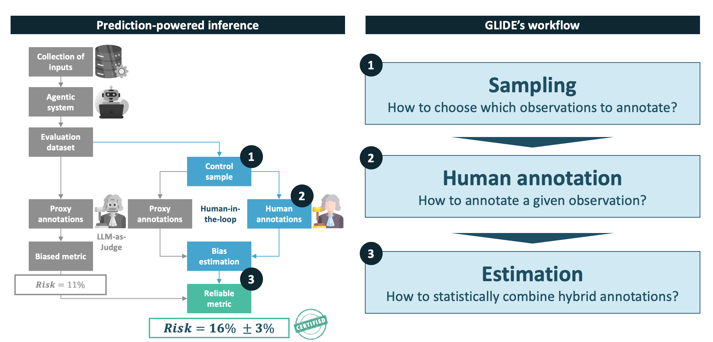

# Overview

This guide covers the mathematical foundations of each stage of GLIDE's evaluation workflow, from sampling to estimation.

---

## The evaluation problem

Suppose you have an AI system that produces answers over a large dataset of $N$ samples, and you want to measure its performance, for example its accuracy, relevance score, or any other scalar metric $\theta^*$.

Computing $\theta^*$ exactly requires reliable annotations $Y$ for every sample. Human annotations are reliable but expensive, so in practice you only label a small subset of $n \ll N$ samples. A natural shortcut is to use **proxy labels** $\tilde{Y}$ (automated predictions from, for example, an LLM-as-Judge) to cover all $N$ samples cheaply. The problem: proxy labels are generally **biased** ($E[\tilde{Y}] \neq \theta^*$), so naively averaging them gives a systematically wrong estimate of $\theta^*$.

GLIDE addresses this by combining large pools of cheap proxy labels with small sets of human labels to produce unbiased, reliable estimates of $\theta^*$. By combining these two sources, GLIDE can achieve the same statistical precision as a purely human-labeled approach, at a fraction of the annotation cost. Actual savings depend on the annotation effort required and how well the proxy aligns with human judgement, but the potential gains can be substantial. This makes rigorous performance evaluation tractable even for large-scale AI systems.

Once a system is deployed, the same combination of proxy and human labels can be used to monitor $\theta^*$ for drift over successive batches of production data, rather than only estimating it once.

The workflow has three stages:

  

### Do you need a sampler?

If you already have human labels for a uniformly drawn random subset of the data (for example, from a pre-existing annotation campaign), you can skip the sampling stage entirely and go straight to the estimator.

A sampler is useful when you still need to **allocate an annotation budget** and want to do so in the most efficient way to reduce downstream estimation uncertainty. A naive uniform sampling strategy may lead to sub-optimal annotation budget allocation in this regard.

---

## Stage 1: Sampling

You start with a fully proxy-labeled dataset. The sampler's job is to decide which samples to send for human annotation, returning a binary selection indicator $\xi_i$ for each sample. Samplers that use non-uniform selection also compute a drawing probability $\pi_i$ per sample, which the downstream estimator uses to correct for sampling bias.

Samplers can exploit the structure of the data or auxiliary information to allocate the annotation budget more efficiently. For example, a sampler may use predefined strata to ensure balanced coverage across subgroups, or it may rely on per-instance auxiliary signals (such as proxy label uncertainty) to focus annotation on the most informative samples.

---

## Stage 2: Human annotation

The selected samples ($\xi_i = 1$) must be labeled by humans before estimation can proceed. This is typically handled through an annotation process, where annotators are presented with each item and record their judgements according to a predefined rubric.

For many evaluation tasks, such as assessing factual accuracy, safety, or subtle reasoning, the annotation requires genuine expertise: annotators must be qualified to make reliable judgements on the items at hand. Expert annotation is accurate, but calling upon it comes at a cost, which is why allocating the annotation budget efficiently matters.

Once all selected samples have been labeled, you have everything needed to run the estimator.

---

## Stage 3: Estimation

Once human labels $Y_i$ have been collected for samples with $\xi_i = 1$, the estimator combines them with the proxy labels to produce an unbiased mean estimate and a confidence interval.

---

## In this guide

- [Samplers](samplers.md) — mathematical foundations of the available samplers in the library.
- [Estimators](estimators.md) — mathematical foundations of the available estimators in the library.
- [Monitors](monitors.md) — mathematical foundations of anytime-valid drift monitoring, for tracking a deployed metric over successive batches.
